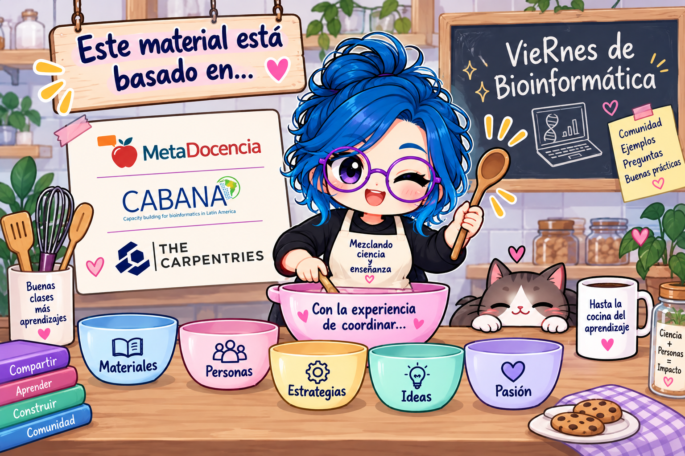

{fig-align="center"}

::: {.callout-note icon="false"}
## Presentación creada en Rmarkdown

Da click en el siguiente link para que puedas ver la [presentación completa](https://eveliacoss.github.io/RIABIA_Rladies2026_Clase_enlinea_presentacion/Seccion6_EnsenarLinea.html).
:::

## Lista de verificación para sesiones en línea:

> Da un trocito de ti para tus participantes.

#### 🎥 **Audio y video**

- Cámara encendida y enfocada correctamente.
- Micrófono encendido y funcionando.
- Confirmar con los participantes que te escuchan bien.

### 🧑‍🏫 **Dinámica con los participantes**

- 👋 Saluda y genera un ambiente cálido desde el inicio.🎨 **Uso de materiales**
- 🗓️ Indica la agenda y tiempos estimados (cuánto dura, si habrá descansos).
- 📌 Usa sus nombres al interactuar para hacerlo más personalizado.
- 🙋‍♀️ Anima a los participantes a prender cámara si es posible (sin forzar).

#### 🖥️ **Materiales y visibilidad**

- Tamaño de letra legible en presentaciones y demos en vivo.
- Usar fondo claro (preferentemente blanco) para código o documentos.
- En RStudio, mantener el tema visual en modo claro (default) si estás enseñando.

#### 🔗 **Pantalla compartida**

- Verificar que estás compartiendo la pantalla correcta en Zoom o Meet.
- Confirmar con la audiencia que pueden ver bien lo que compartes.

### 🎨 **Uso de materiales**

- 🖼️ Incluye imágenes, diagramas y ejemplos reales para mantener el interés.
- 🧭 Usa punteros o destaca elementos en la pantalla para guiar visualmente.
- 🔄 Si das instrucciones, muéstralas por escrito además de decirlas en voz alta.

### 🎯 **Preparación técnica**

- 🔌 Ten un cable de red como respaldo si tu WiFi es inestable.
- 🔋 Asegúrate de que tu computadora esté cargada o conectada a corriente.
- 🔕 Silencia notificaciones de correo, WhatsApp y otras apps durante la sesión.

### ⏱️ **Gestión del ritmo**

- ⏸️ Planifica pausas cada 60--90 minutos para descanso o preguntas.
- ⏳ Marca el cambio entre secciones para que los alumnos sigan el hilo.
- 🎥 Graba la sesión si es posible, para quienes no puedan asistir en vivo (pedir permiso a las asistentes antes de empezar a grabar o contar con su permiso previo).

### 📬 **Seguimiento y apoyo**

- 📁 Envía materiales antes o después de la sesión.
- 📩 Deja un canal de comunicación abierto (correo, chat, foro).
- 🧭 Ofrece indicaciones claras sobre qué hacer después de la sesión (actividad, lectura, entrega, etc.)
