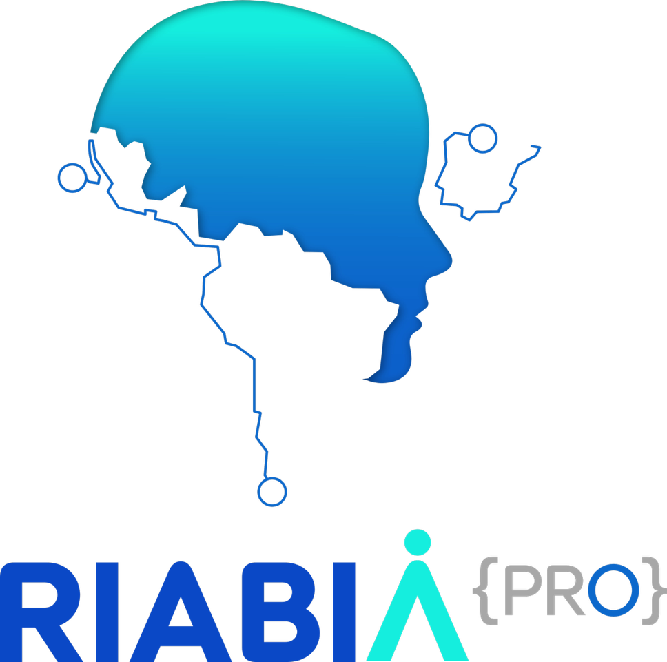
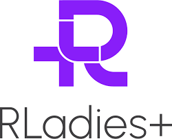
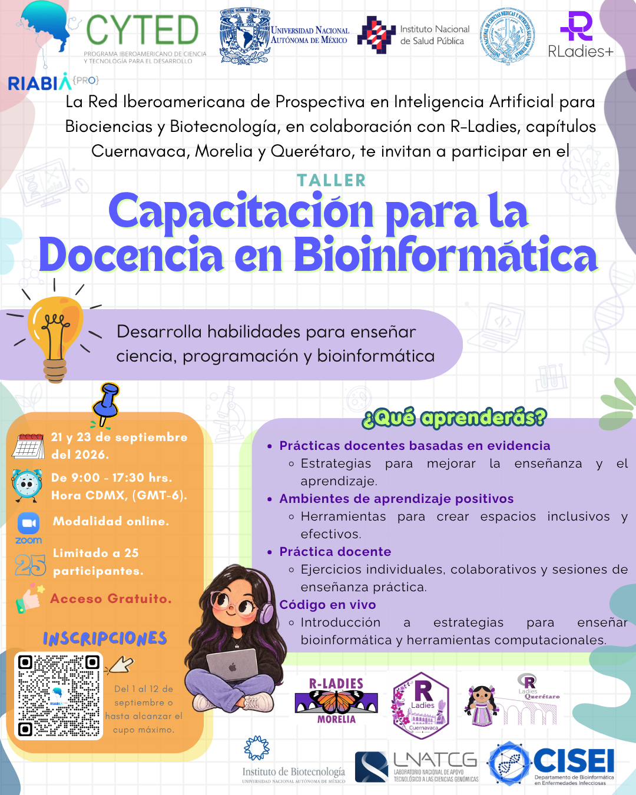
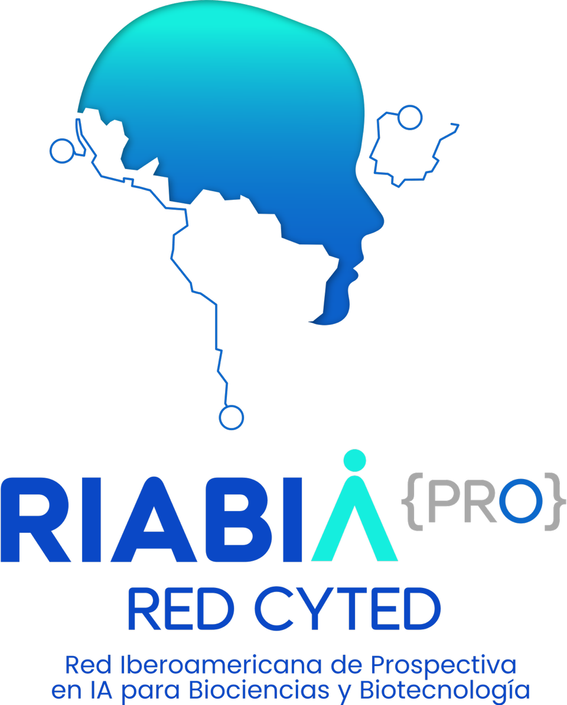
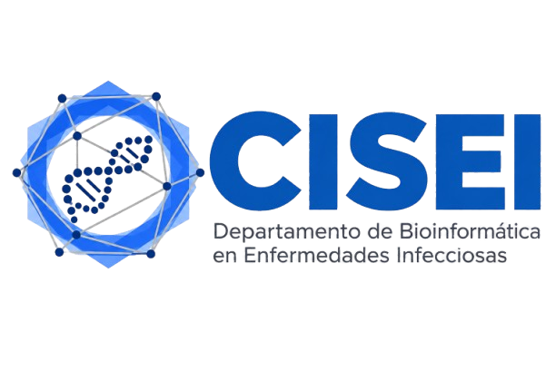
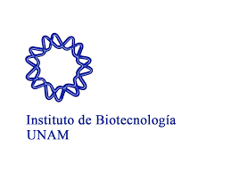
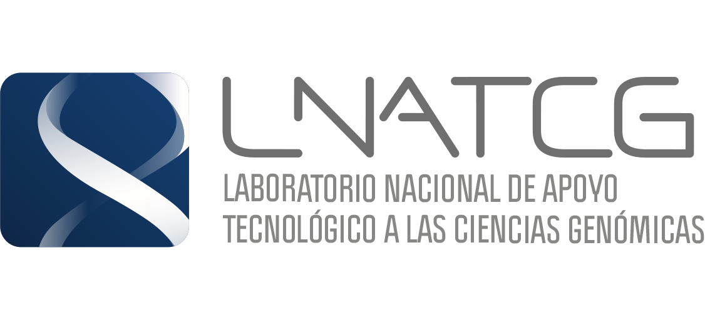
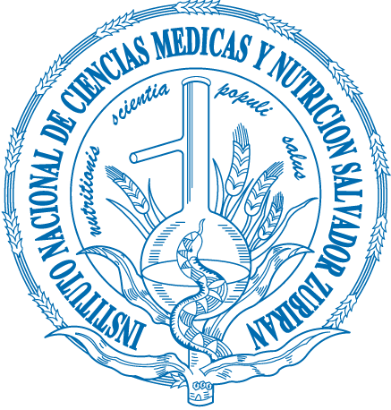
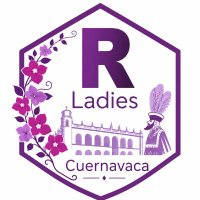
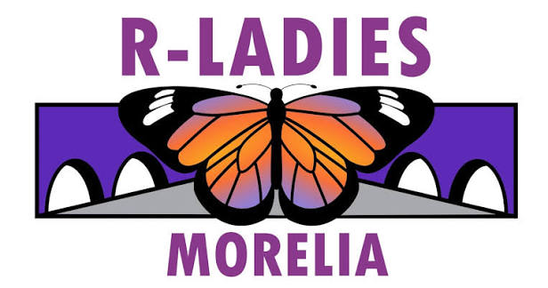

::: {layout-ncol="2"}
{fig-align="left" width="219"}

{fig-align="right" width="228"}
:::

# Información general {.unnumbered}

- :::: {.panel-tabset group="globalInfo"}
  ### Sobre el curso 📌

  Durante el curso, utilizaremos una variedad de recursos, que incluyen materiales prácticos y teóricos para el desarrollo de habilidades de enseñanza en bioinformática. Entre los principales materiales se encuentran los proporcionados por [MetaDocencia y CABANAnet](https://www.metadocencia.org/curso/entrenamiento-instructores/), [The Capentries](https://carpentries.github.io/instructor-training/) y [Rstudio Education](https://education.rstudio.com/trainers/#info).

  - **Fechas:** 21 y 23 de septiembre de 2026
  - **Duración del curso:** 16 horas (8 horas diarias)
  - **Horario:** 9 a 18 h (Hora de la Ciudad de México)
  - **Modalidad:** Virtual

  #### **Instructoras certificadas con The Carpentries:**

  - **M.C. Verónica Jiménez Jacinto -** RLadies Cuernavaca; Coordinadora del comité de entrenamiento de la Red Iberoamericana de Prospectiva de IA para Biociencias y Biotecnología. **veronica.jimenez\@ibt.unam.mx**
  - **Dra. Ernestina Godoy Lozano** - Jefa del Departamento de Bioinformática en Enfermedades Infecciosas del CISEI, INSP; Instructora y Trainer certificada de The Carpentries; RLadies Cuernavaca. **tinagodoy\@gmail.com**
  - **Dra. Evelia Coss** - Profesora de asignatura de la ENES-Juriquilla UNAM, VieRnes de Bioinformática, RSG México y Rladies Morelia. [Web page](https://eveliacoss.github.io/), **ecossnav\@gmail.com**
  - **cDra. Quetzally Medina Velázquez -** Estudiante de doctorado en la carrera de Ciencias Biomédicas por la UNAM (INCMNSZ); Presidenta de la A.C. Comunidad de Científicas Mexicanas; Rladies Morelia. **quetzally.medina.velazquez\@gmail.com**
  - **Dra. Nelly Sélem Mojica** - Profesora investigadora en el Centro de Ciencias Matemáticas UNAM Morelia; RLadies Morelia; RSG México; ISCB-Wikipedia. **nselemmatmor.unam.mx**
  - **cDra. Sofía Zorrilla Azcué** - Estudiante de doctorado en el Instituto de Biología de la UNAM y Kew Royal Botanic; profesora de asignatura en Ciencias Ambientales en la ENES Morelia; RLadies Morelia. [Web page](https://github.com/sofiazorrilla); **sofia.zorrilla95\@gmail.com**

  

  #### **Descripción**

  Este curso de formación de instructoras/es está diseñado para preparar a personas interesadas en convertirse en instructores tipo Carpentries. Sin embargo, gran parte de nuestro plan de estudios se centra en principios educativos que pueden aplicarse en una amplia variedad de contextos. También damos la bienvenida a las/os participantes que simplemente desean mejorar sus habilidades docentes.

  #### **Objetivo**

  Elevar la calidad de los talleres y cursos impartidos por los miembros de RIABIA.

  El entrenamiento de instructores tiene los siguientes objetivos específicos para los participantes:

  - Introducir a los participantes en las prácticas docentes basadas en evidencia.
  - Enseñar cómo crear un ambiente positivo para los alumnos en cualquier taller.
  - Brindar oportunidades para practicar y desarrollar sus habilidades de enseñanza.
  - Brindar una introducción al código en vivo para la enseñanza de bioinformática y herramientas computacionales en la ciencia.

  Debido a que tenemos un tiempo limitado, algunas cosas están más allá del alcance de esta capacitación. No estaremos aprendiendo:

  - Cómo programar en R o Python, usar Git o SQL, o cualquiera de los otros temas que se enseñan en [Data Carpentry](https://datacarpentry.org/), [Library Carpentry](https://librarycarpentry.org/), o talleres de [Software Carpentry](https://software-carpentry.org/).
  - Cómo crear sus propias lecciones desde cero (aunque tendrán un buen punto de partida en los principios que sustentan este tipo de trabajo si desean profundizar en el tema.).
  - Cómo hacer análisis bioinformáticos o ejecutar pipelines de análisis genómico y transcriptómico.

  Los eventos de formación de instructores son prácticos en todo momento: las lecciones breves se alternan con ejercicios prácticos individuales y en grupo, incluidas sesiones de enseñanza práctica.

  #### **Enfoque de la audiencia**

  Instructores con experiencia en la enseñanza de programación para científicos, análisis bioinformáticos, ciencias de datos o cualquier otro tema, en el que deseen mejorar sus habilidades docentes.

  ## Citar y reutilizar el material del curso

  Los datos del curso se pueden reutilizar y adaptar libremente con la debida atribución. Todos los datos de los cursos de estos repositorios están sujetos a la licencia [Attribution-NonCommercial-ShareAlike 4.0 International (CC BY-NC-SA 4.0)](https://creativecommons.org/licenses/by-nc-sa/4.0/).

  ### Requisitos previos

  Se recomienda a los participantes que:

  - Estén cursando un posgrado o tengan varios años de experiencia en investigación o educación universitaria.

  - Se encuentren trabajando en una institución latinoamericana y se prevea que permanezcan en ella al menos durante el próximo año.

  - Tengan un gran interés en la enseñanza y hayan participado previamente en programas de formación.

  - Hayan identificado una necesidad o brecha en la cual pueden ofrecer capacitación y ya hayan reflexionado sobre el tipo de formación que desean brindar.

  ### Agenda 📆 {#agenda}

  **Dia 1**

  +-------------------------------------------------------------------------+---------------+------------------+
  | Tema                                                                    | Tiempo        | Instructora      |
  +=========================================================================+:=============:+==================+
  | **Lunes 21 de septiembre (9:00 - 18:00)**                               |               |                  |
  +-------------------------------------------------------------------------+---------------+------------------+
  | 🔷 **Sección 1 - (9:00 - 11:30 h)**                                     |               |                  |
  +-------------------------------------------------------------------------+---------------+------------------+
  | - Bienvenida e introducción                                             | 2h 30 min     | Quetzally Medina |
  +-------------------------------------------------------------------------+---------------+------------------+
  | ☕ *break (11:30 - 12:00) ☕*                                           | 30 min        |                  |
  +-------------------------------------------------------------------------+---------------+------------------+
  | 🔷 **Sección** **2 - (12:00-14:30 h)**                                  |               |                  |
  +-------------------------------------------------------------------------+---------------+------------------+
  | - Modelos mentales y carga cognitiva                                    | 2h 30 min     | Ernestina Godoy  |
  +-------------------------------------------------------------------------+---------------+------------------+
  | *🍕 Comida (14:30 - 15:30 h) 🍕*                                        | 1 h           |                  |
  +-------------------------------------------------------------------------+---------------+------------------+
  | 🔷 **Sección** **3 - (15:30-18:00 h)**                                  |               |                  |
  +-------------------------------------------------------------------------+---------------+------------------+
  | - Memoria y otros principios                                            | 2h 30 min     | Verónica Jiménez |
  +-------------------------------------------------------------------------+---------------+------------------+
  | [Cuestionario de evaluación Día 1](https://forms.gle/qv1nyL25TFqJh8CLA) |               |                  |
  +-------------------------------------------------------------------------+---------------+------------------+

  **Dia 2**

  +-------------------------------------------------------------------------+--------------+----------------+
  | Tema                                                                    | Tiempo       | Instructora    |
  +=========================================================================+:============:+================+
  | **Miércoles 23 de septiembre (9:00 - 18:00)**                           |              |                |
  +-------------------------------------------------------------------------+--------------+----------------+
  | 🔷 **Sección 4 - (9:00 - 11:30 h)**                                     |              |                |
  +-------------------------------------------------------------------------+--------------+----------------+
  | - Enseñar en línea y planificación de cursos                            | 2h 30 min    | Evelia Coss    |
  +-------------------------------------------------------------------------+--------------+----------------+
  | ☕ *break (11:30 - 12:00) ☕*                                           | 30 min       |                |
  +-------------------------------------------------------------------------+--------------+----------------+
  | 🔷 **Sección** **5 - (12:00-14:30 h)**                                  |              |                |
  +-------------------------------------------------------------------------+--------------+----------------+
  | - Audiencia y simulación de entrenamiento                               | 2h 30 min    | Nelly Sélem    |
  +-------------------------------------------------------------------------+--------------+----------------+
  | *🍕 Comida (14:30 - 15:30 h) 🍕*                                        | 1 h          |                |
  +-------------------------------------------------------------------------+--------------+----------------+
  | 🔷 **Sección 6 - (15:30-18:00 h)**                                      |              |                |
  +-------------------------------------------------------------------------+--------------+----------------+
  | - Programación en vivo y entrenamientos                                 | 2h 30 min    | Sofía Zorrilla |
  +-------------------------------------------------------------------------+--------------+----------------+
  | [Cuestionario de evaluación Día 2](https://forms.gle/esibtLAGrZExAS8C6) |              |                |
  +-------------------------------------------------------------------------+--------------+----------------+

  ### Comité organizador

  Este evento se encuentra organizado por la **Red Iberoamericana de Prospectiva en AI para Biociencia y Botecnología (RIABIA);** **RLadies Cuernavaca** y **RLadies Morelia.**

  - **Nelly Selem** - RLadies Morelia; Centro de Ciencias Matemáticas (CCM- UNAM)
  - **Evelia Lorena Coss Navarrete** - ENES-Juriquilla UNAM, VieRnes de Bioinformática, RSG México y Rladies Morelia.
  - **Verónica Jiménez Jacinto -** RLadies Cuernavaca; RIABIA.
  - **Ernestina Godoy Lozano** - Departamento de Bioinformática en Enfermedades Infecciosas del CISEI, INSP; RLadies Cuernavaca.
  - **Quetzally Medina Velázquez -** INCMNSZ; A.C. Comunidad de Científicas Mexicanas; Rladies Morelia.
  - **Sofía Zorrilla Azcué** - Instituto de Biología de la UNAM y Kew Royal Botanic; ENES Morelia; RLadies Morelia.
  - **Karla Leslie Matías Valdez** - Instituto Nacional de Salud Pública/México; karla.matias\@insp.mx.
  - **Mayra del Carmen Fragoso Medina** - Rladies Morelia; mcfragoso\@cieco.unam.mx

  #### **Patrocinadores**

  ::: {layout-ncol="3"}
  {width="157"}

  {fig-align="left" width="227"}

  {width="241"}

  {width="315"}

  {width="131"}

  {width="123"}

  {width="232"}
  :::
  ::::
